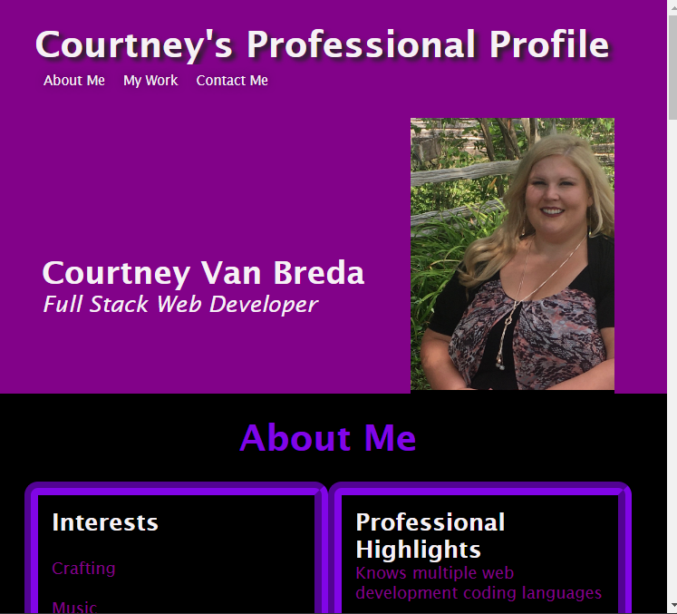

# Challenge-Two
Portfolio

## Assignment
* create apotential deployed portfolio of work samples
* so that a potential employer can review samples of my work and assess whether I'll be a good candidate for an open position
* use advanced html and css stylings

## Built With
* HTML
* CSS

## Website
https://cvanbreda91.github.io/Challenge-Two/

## Contribution
Made with ❤️ by Courtney

## Styles
* flexbox
* media queries
* pseudo-classes
* text shadow
* border radius
* sticky header

